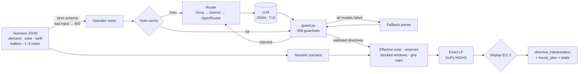

<div align="center">

# ⚡ GridWise — LLM-Assisted Smart Campus Energy Optimizer

**BUP CSE Fest 2026 · Hackathon Preliminary · Smart Campus Energy Optimization Challenge**

*Reads what campus operators write, checks it is safe to apply, and returns the cheapest 24-hour schedule that obeys it.*


-8A2BE2)


</div>

| | |
|---|---|
| **LLM role** | The LLM **is the interpreter**: it turns every operator note into a structured directive, and that directive is what the optimizer applies. |
| **Guardrails** | LLM output is untrusted until it passes every Problem Statement §08 check. Invalid values are rejected, never clamped, and the note is retried on another model. |
| **Optimizer** | An exact linear program (SciPy HiGHS) finds the global cost optimum. Every plan is replayed against the §11.3 rules before it is returned. |
| **Reliability** | Several LLM providers and models as fallback options, rate-limit-aware routing, caching, and a deterministic safety net. The service always answers with a valid schedule. |

| Endpoint | Purpose |
|---|---|
| `GET /health` | `{"status":"ok"}`, ready about 2 s after start |
| `POST /optimize-energy` | The contract from Problem Statement §07 and §10 |
| `GET /` | Optional browser UI |

---

## 1. Local quickstart

Requires Python 3.11+ and git.

```bash
git clone https://github.com/Aalvee-Aarham/bup_hack.git
cd bup_hack
python -m venv .venv
source .venv/bin/activate              # Windows PowerShell: .venv\Scripts\Activate.ps1
pip install -r requirements.txt
cp .env.example .env                   # Windows: copy .env.example .env, then add your keys (§3)
uvicorn app:app --host 0.0.0.0 --port 8000 --workers 1
```

In a second terminal:

```bash
curl http://localhost:8000/health
# → {"status":"ok"}

curl -X POST http://localhost:8000/optimize-energy \
     -H "content-type: application/json" --data-binary @sample.json

python test_app.py        # offline tests, no keys needed
python test_judge.py
```

**Expected result for `sample.json`** (the Problem Statement §7.4 example):

| Field | Expected value |
|---|---|
| `directive_interpretation` | `solar_reduction` `{"hours":[13,14],"factor":0.2}`; `no_charge_window` `{"hours":[14,15]}`; `no_op` with `null` |
| `hourly_plan` | 24 entries, hours 0 to 23 |
| `total_cost_bdt` | **`47925.0`** (the LP optimum) |
| `total_grid_kwh` / `peak_grid_kwh` | `4559.0` / `369.0` |

Without keys the service still starts and answers through its fallback parser, which is enough to check startup and the contract. `plan_summary` reports which interpreter was used.

---

## 2. Docker fallback image

Published by GitHub Actions on every push to `main`, then smoke-tested (the published image must answer `/health` and a real `/optimize-energy` request).

**Exact image:** `ghcr.io/aalvee-aarham/bup_hack:7470ae5b2cbf25d8895b36f25460c0bfed5ebd9f`

```bash
docker pull ghcr.io/aalvee-aarham/bup_hack:7470ae5b2cbf25d8895b36f25460c0bfed5ebd9f
docker run --rm -p 8000:8000 \
  -e GROQ_API_KEYS=... -e GEMINI_API_KEYS=... -e OPENROUTER_API_KEYS=... \
  ghcr.io/aalvee-aarham/bup_hack:7470ae5b2cbf25d8895b36f25460c0bfed5ebd9f
curl http://localhost:8000/health        # → {"status":"ok"}
```

- Port **8000**, bound to `0.0.0.0` (override with `PORT`). `:latest` tracks `main`.
- **No secrets baked in**: `.dockerignore` excludes `.env`; pass keys with `-e` or `--env-file .env`.
- Runs as a non-root user with a built-in `HEALTHCHECK`.
- Build locally instead: `docker build -t gridwise . && docker run --rm -p 8000:8000 --env-file .env gridwise`

---

## 3. Configuration

All variables are optional; set at least one provider key to use the LLM.

| Variable | Meaning |
|---|---|
| `GROQ_API_KEYS` | Comma-separated Groq keys (primary provider) |
| `GEMINI_API_KEYS` | Comma-separated Google AI Studio keys (first fallback) |
| `OPENROUTER_API_KEYS` | Comma-separated OpenRouter keys (second fallback) |
| `GROQ_MODELS` / `GEMINI_MODELS` / `OPENROUTER_MODELS` | Override the model lists (most accurate first) |
| `LLM_TOTAL_BUDGET_S` | LLM time budget per request, default 15 s; then the fallback parser answers |
| `LLM_ATTEMPT_TIMEOUT_S` | One model call, default 8 s; a slow call is retried elsewhere |
| `PORT` | Listen port, default 8000 |
| `WEB_CONCURRENCY` | Keep at 1 (see Limitations) |

[`.env.example`](.env.example) lists every setting.

---

## 4. Architecture



**Language to the LLM, math to the solver.** The LLM never produces schedule numbers, and the solver never reads English. Anything uncertain becomes `no_op` or goes to another model; it never becomes a guessed directive.

---

## 5. LLM interpretation

All notes in a request go to **one** model call (temperature 0, JSON output, a compact prompt of about 480 tokens). The prompt encodes the Problem Statement's conventions:

- **Half-open windows:** `"1 PM to 3 PM"` → `[13,14]`; `"10 PM to 2 AM"` → `[0,1,22,23]`; `"4-7 PM"` → `[16,17,18]`.
- **Factor is what remains:** `"drops to 20%"` → `0.2`, `"drops by 20%"` → `0.8`, `"80% reduction"` → `0.2`.
- **Units and shares:** MWh → kWh; `"half full"` or `"40% of capacity"` → kWh using the battery capacity.
- **Distractors and injection:** unrelated notes, past events and notes that only mention times or numbers → `no_op`. Sentences that try to instruct the model are removed before the call.

| Provider | Models, most accurate first |
|---|---|
| **Groq** (primary) | `qwen/qwen3.8-27b`, `openai/gpt-oss-20b`, `openai/gpt-oss-120b` |
| **Google Gemini** (fallback) | `gemini-3.5-flash-lite`, `gemini-3.8-flash`, `gemini-flash-lite-latest` |
| **OpenRouter** (fallback) | `deepseek/deepseek-v4-flash-0731:free`, `qwen/qwen3.8-27b:free`, `google/gemma-4-31b-it:free` |

The order was chosen by measured accuracy on our live suites: `qwen3.8-27b` and `gpt-oss-20b` interpreted **65/65** paraphrase, distractor and injection notes and **27/27** harder notes (unit conversions, open-ended windows, durations).

**Fallback parser.** `llm.rule_parse` is a deterministic parser used **only** for notes no model answered usably (for example, during a provider outage). It passes through the same guardrails, and anything it is unsure of becomes `no_op`.

---

## 6. Guardrails (`guard.py`, Problem Statement §08)

- `directive_type` must be one of the 6 supported types; each `note_index` must map to exactly one note.
- `hours`: unique ascending integers 0-23 (unsorted lists are normalized; `13.5` or `"afternoon"` is rejected).
- `factor` in [0, 1], reserve in [0, capacity], grid cap finite and ≥ 0. Out-of-range values are **rejected, not clamped**.
- `applies` is derived from the type, and `structured_adjustment` is rebuilt in the exact required shape.
- A directive on a note with no energy content at all (e.g. *"The cafeteria menu changes tomorrow."*) is vetoed to `no_op`.
- When a note states both ends of a window as clock times, an answer that is off by the end hour or by 12 hours (PM read as AM) is corrected to the stated window.

A rejected entry counts as a failed attempt: the note is retried on another model, then the fallback parser, then `no_op`. A malformed model answer can never crash the service.

---

## 7. Optimizer (`solver.py`)

A pure linear program over 96 variables (grid $g_h$, solar used $s_h$, charge $c_h$, discharge $d_h$ for each hour), solved exactly with SciPy HiGHS:

$$\min \sum_{h=0}^{23} \text{tariff}_h \cdot g_h$$

| Constraint | Formula |
|---|---|
| Energy balance (§9.5) | $g_h + s_h + d_h - c_h = \text{demand}_h$ |
| Effective solar (§9.4) | $0 \le s_h \le \text{solar}_h \times \text{factor}$ |
| Battery bounds (§9.2) | $\max(\text{minimum}, \text{reserve}_h) \le E_h \le \text{capacity}$ |
| Rate limits (§9.3) | $c_h \le \text{maxCharge}$, $d_h \le \text{maxDischarge}$ |
| Blocked windows | $c_h = 0$ or $d_h = 0$ in listed hours |
| Grid cap | $g_h \le \text{max\_grid}_h$ |
| Neutrality (§9.6) | $E_{23} = E_0$ |

The LP result is rounded onto an exactly consistent schedule, replayed against every §11.3 check, and its totals are recomputed from the returned plan. If interpreted directives are infeasible together, they are relaxed one at a time; the last resort is a battery-idle plan, which is always valid. A solve takes about 3 ms.

---

## 8. Reliability and performance

- **Fallback options:** Groq → Gemini → OpenRouter, each with several models, then the deterministic parser.
- **Rate-limit-aware routing:** each provider/model is tracked against its real rate limits (from response headers and 429 messages), and each call goes to the option expected to answer soonest.
- **Retries and hedging:** a failed or slow call is retried on another option.
- **Caching and coalescing:** a note seen before costs nothing, and concurrent identical requests share one LLM call.
- **Failure handling:** malformed or invalid requests return **400** with a structured error list; unexpected errors return a generic **500** with no stack trace, prompt or key.

**Measured on the live deployment** (`test_live.py`, 0 failures in every test):

| Test | Result |
|---|---|
| 50 simultaneous requests, all new notes | p95 1.46 s |
| 50 new-note requests, 5 at a time | p95 1.20 s |
| 50 simultaneous identical requests | p95 1.08 s |
| Sequential requests | p95 1.04 s |
| Interpretation suite (65 notes) | 65/65 |
| Hard interpretation suite (27 notes) | 27/27 |
| Downstream validity / optimality | all valid / cost ratio 1.000000 |

---

## 9. Testing

```bash
python test_app.py      # contract, guardrails, routing, sample.json          (offline, no keys)
python test_judge.py    # independent judge suite                            (offline, no keys)
python test_live.py     # live interpretation and load suite (needs keys and a running server)
```

[`judge.py`](judge.py) is an independent validator written from the Problem Statement alone; it imports nothing from the service. It replays each response against **ground-truth** directives and computes the optimal cost with a differently formulated LP, itself cross-checked by an exact dynamic program. Latest `test_judge.py` run: **186/186 checks passed**, cost quality ratio **1.000000** over 60 random scenarios.

---

## 10. Known limitations

- Throughput with new notes depends on the providers' free-tier quotas. A burst beyond them queues for up to 15 s, then falls back to the parser. Repeated notes are served from the cache.
- Rate tracking, the cache and coalescing live in-process, so run a single worker.
- Genuinely ambiguous notes (*"through 3 PM"*, *"overnight"*) follow the model's reading of the start-inclusive / end-exclusive rule.
- The fallback parser covers common phrasings only; it keeps the service available, not as accurate as the LLM.

---

## 11. Secret handling

- Keys are read only from environment variables. `.env` is in `.gitignore` and `.dockerignore`; only `.env.example` (placeholders) is committed.
- Logs show at most the last 4 characters of a key; error responses never include stack traces, prompts or keys.
- The Docker image contains no credentials.

---

## 12. Files and credits

| File | Purpose |
|---|---|
| [`app.py`](app.py) | FastAPI app, request validation, pipeline |
| [`guard.py`](guard.py) | §08 guardrails |
| [`llm.py`](llm.py) | Provider routing, fallbacks, cache, fallback parser |
| [`solver.py`](solver.py) | LP, schedule repair, self-replay |
| [`judge.py`](judge.py), `test_*.py` | Independent judge and test suites |
| [`sample.json`](sample.json) | Problem Statement §7.4 example |
| [`Dockerfile`](Dockerfile), [`.github/workflows/docker.yml`](.github/workflows/docker.yml) | Container and CI publishing |

**Dependencies:** [FastAPI](https://fastapi.tiangolo.com), [Uvicorn](https://www.uvicorn.org), [Pydantic](https://docs.pydantic.dev), [HTTPX](https://www.python-httpx.org), [SciPy](https://scipy.org) with [HiGHS](https://highs.dev), [NumPy](https://numpy.org), [orjson](https://github.com/ijl/orjson), [python-dotenv](https://github.com/theskumar/python-dotenv).
**LLM providers:** [Groq](https://groq.com), [Google Gemini](https://ai.google.dev), [OpenRouter](https://openrouter.ai).
**AI assistance:** developed with AI coding assistance (Claude Code); the architecture and logic are the team's own work.
