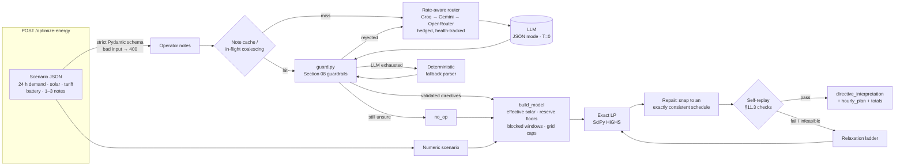

<div align="center">

# ⚡ GridWise — LLM-Assisted Smart Campus Energy Optimizer

**BUP CSE Fest 2026 · Hackathon Preliminary · Smart Campus Energy Optimization Challenge**

*Reads what campus operators write, proves it is safe to apply, and returns the cheapest 24-hour schedule that obeys it.*


-8A2BE2)


</div>

---

## Contents

1. [At a glance](#-at-a-glance)
2. [Local quickstart](#-1-local-quickstart-clean-machine)
3. [Docker fallback image](#-2-docker-fallback-image)
4. [Configuration](#-3-configuration)
5. [Architecture](#-4-architecture)
6. [Stage 1: the LLM interpreter](#-5-stage-1--llm-interpretation)
7. [Stage 2: deterministic guardrails](#-6-stage-2--deterministic-guardrails)
8. [Stage 3: the optimizer](#-7-stage-3--exact-optimizer)
9. [Reliability and performance](#-8-reliability--performance-engineering)
10. [Verification and test results](#-9-verification--test-results)
11. [How we cover the rubric](#-10-rubric-coverage-map)
12. [Known limitations](#-11-known-limitations)
13. [Secret handling](#-12-secret-handling)
14. [Files, dependencies and credits](#-13-files-dependencies--credits)

---

## ✨ At a glance

| | |
|---|---|
| **Problem** | Take 24 hours of demand, solar and tariff data plus 1-3 natural-language operator notes, and return a valid, cost-minimal grid/solar/battery schedule that obeys every note that applies. |
| **LLM role** | The LLM **is the interpreter**. Every note goes to an LLM, which turns it into a structured directive, and that directive is what the optimizer applies. |
| **Guardrails** | LLM output is treated as untrusted until it passes every Section 08 check. Out-of-range values are **rejected, never clamped**, and a rejected answer goes to another model. |
| **Optimizer** | An **exact linear program** (96 variables, solved with SciPy HiGHS) that finds the global cost optimum. The result is snapped onto an exactly consistent schedule and **replayed against the judge's own Section 11.3 rules** before it is returned. |
| **Proof** | An independent judge (`judge.py`) written only from the Problem Statement, a second LP formulation, and an **exact dynamic-programming cross-check**. Across 60 random scenarios the cost quality ratio is **1.000000**. |
| **Resilience** | 3 providers × 3 models × N keys, rate-limit-aware routing, hedged requests, caching, request coalescing, and a deterministic safety net. The service **always answers** with a valid schedule. |

| Endpoint | Purpose |
|---|---|
| `GET /health` | `{"status":"ok"}`, ready about 2 s after start. It never waits on an LLM. |
| `POST /optimize-energy` | The contract from Problem Statement §07 and §10. |
| `GET /` | Optional browser UI for trying scenarios by hand. |
| `GET /stats` | Optional live view of key and model budgets and health. Keys are masked. |

---

## 🚀 1. Local quickstart (clean machine)

**You need:** Python 3.11+ (tested on 3.12 and 3.14) and git. That's all.

```bash
git clone https://github.com/Aalvee-Aarham/bup_hack.git
cd bup_hack
python -m venv .venv
source .venv/bin/activate              # Windows PowerShell: .venv\Scripts\Activate.ps1
pip install -r requirements.txt
cp .env.example .env                   # Windows: copy .env.example .env   → then paste your keys (§3)
uvicorn app:app --host 0.0.0.0 --port 8000 --workers 1
```

In a second terminal:

```bash
# 1) readiness
curl http://localhost:8000/health
# → {"status":"ok"}

# 2) the public sample (Problem Statement §7.4)
curl -X POST http://localhost:8000/optimize-energy \
     -H "content-type: application/json" --data-binary @sample.json

# 3) the offline test suites (no keys needed)
python test_app.py
python test_judge.py
```

### Expected result for `sample.json`

| Field | Expected value |
|---|---|
| `directive_interpretation[0]` | `solar_reduction`, `{"hours":[13,14], "factor":0.2}`, `applies: true` |
| `directive_interpretation[1]` | `no_charge_window`, `{"hours":[14,15]}`, `applies: true` |
| `directive_interpretation[2]` | `no_op`, `structured_adjustment: null`, `applies: false` |
| `hourly_plan` | 24 entries, hours 0 to 23 |
| `total_cost_bdt` | **`47925.0`**, the proven LP optimum (any other valid plan with the same cost is equally correct) |
| `total_grid_kwh` / `peak_grid_kwh` | `4559.0` / `369.0` |
| `plan_summary` | ends with `Interpretation source: groq:<model>` (or `rules` when no keys are configured) |

<details>
<summary><b>Sample response (abridged)</b></summary>

```json
{
  "scenario_id": "GRID-101",
  "directive_interpretation": [
    {"note_index": 0, "applies": true,  "directive_type": "solar_reduction",
     "structured_adjustment": {"hours": [13, 14], "factor": 0.2},
     "explanation": "Solar drops to 20% from 1 PM to 3 PM."},
    {"note_index": 1, "applies": true,  "directive_type": "no_charge_window",
     "structured_adjustment": {"hours": [14, 15]},
     "explanation": "Battery charging blocked 2 PM to 4 PM."},
    {"note_index": 2, "applies": false, "directive_type": "no_op",
     "structured_adjustment": null,
     "explanation": "Cafeteria menu does not affect energy."}
  ],
  "hourly_plan": [
    "...",
    {"hour": 13, "grid_kwh": 369.0, "solar_used_kwh": 56.0,  "battery_action": "charge", "battery_kwh": 100.0, "battery_energy_after_kwh": 500.0},
    {"hour": 14, "grid_kwh": 270.0, "solar_used_kwh": 50.0,  "battery_action": "idle",   "battery_kwh": 0.0,   "battery_energy_after_kwh": 500.0},
    {"hour": 15, "grid_kwh": 110.0, "solar_used_kwh": 200.0, "battery_action": "idle",   "battery_kwh": 0.0,   "battery_energy_after_kwh": 500.0},
    "..."
  ],
  "total_grid_kwh": 4559.0,
  "total_cost_bdt": 47925.0,
  "peak_grid_kwh": 369.0,
  "plan_summary": "Applied 2 of 3 operator notes (no_charge_window, solar_reduction); charged the battery in cheap hours and discharged it into expensive ones for 47925.0 BDT ... Interpretation source: groq:qwen/qwen3.8-27b."
}
```

</details>

> **No keys?** The service still starts and answers through its deterministic fallback parser. That is enough to check startup and the contract, but the LLM is the intended interpreter. `plan_summary` always reports which source was used.

---

## 🐳 2. Docker fallback image

A GitHub Actions workflow (`.github/workflows/docker.yml`) builds and publishes the image on every push to `main`, then smoke-tests the published image itself: it must answer `/health` **and** a real `/optimize-energy` request.

```bash
docker pull ghcr.io/aalvee-aarham/bup_hack:latest
docker run --rm -p 8000:8000 \
  -e GROQ_API_KEYS=... -e GEMINI_API_KEYS=... -e OPENROUTER_API_KEYS=... \
  ghcr.io/aalvee-aarham/bup_hack:latest
# or: docker run --rm -p 8000:8000 --env-file .env ghcr.io/aalvee-aarham/bup_hack:latest

curl http://localhost:8000/health        # → {"status":"ok"}
```

| Property | Value |
|---|---|
| Tags | `:latest` and `:<commit-sha>`, the exact immutable tag of the submitted commit |
| Port | **8000**, bound to `0.0.0.0` (override with `PORT`) |
| Secrets | **None baked in.** `.dockerignore` excludes `.env`, so keys are passed at runtime with `-e` or `--env-file`. |
| Hardening | `python:3.12-slim`, runs as a non-root user (uid 10001), built-in `HEALTHCHECK` |
| Build locally | `docker build -t campus-energy . && docker run --rm -p 8000:8000 --env-file .env campus-energy` |

---

## 🔧 3. Configuration

Every variable is optional, and the service boots with none of them. Set at least one provider key to use the LLM.

| Variable | Default | Meaning |
|---|---|---|
| `GROQ_API_KEYS` | none | Comma-separated Groq keys (**primary** provider) |
| `GEMINI_API_KEYS` | none | Comma-separated Google AI Studio keys (second tier) |
| `OPENROUTER_API_KEYS` | none | Comma-separated OpenRouter keys (third tier) |
| `GROQ_MODELS` / `GEMINI_MODELS` / `OPENROUTER_MODELS` | see §5 | Override the model lists, most accurate first |
| `LLM_TOTAL_BUDGET_S` | `15` | Time budget for the whole LLM cascade in one request, after which the fallback parser answers |
| `LLM_ATTEMPT_TIMEOUT_S` | `8` | Timeout for one model call. A slow call is retried on another slot. |
| `LLM_HEDGE_AFTER_S` | `1.5` | Race a second slot if the first has not answered by then |
| `LLM_CACHE_SIZE` | `20000` | Interpreted notes kept in memory |
| `PORT` | `8000` | Listen port |
| `WEB_CONCURRENCY` | `1` | Keep at 1 (see [Limitations](#-11-known-limitations)) |
| `LOG_LEVEL` | `INFO` | Standard Python log level |

The singular names (`GROQ_API_KEY`, …) are also read. [`.env.example`](.env.example) documents every knob, including the starting rate budgets.

---

## 🏗 4. Architecture

The Problem Statement's core idea is *"human notes are not directly trusted as math."* We built each stage as a separate trust boundary:



The same flow as plain text:

```
operator notes ──► LLM (Groq → Gemini → OpenRouter) ──► guard.py (Section 08 guardrails)
                                                             │ invalid → next model → fallback parser → no_op
                                                             ▼
scenario ─────────────────────────────────────────► solver.py: exact LP (SciPy HiGHS)
                                                             │ replayed against Section 11.3 before return
                                                             ▼
                                        directive_interpretation + hourly_plan + totals
```

**Design principles**

- **Language to the LLM, math to the solver.** The LLM never touches numbers in the schedule, and the solver never reads English.
- **Nothing is trusted on its way in.** Request data goes through strict schema checks and LLM output through the guardrails. Even our own LP output is replayed before it is sent.
- **Fail safe, never fail open.** When something is unsure, the note becomes `no_op` or goes to another model. It never becomes a guessed directive.

---

## 🧠 5. Stage 1: LLM interpretation

All notes in a request go to **one** model call: temperature 0, JSON mode, and a compact system prompt of about 480 tokens that encodes the Problem Statement's conventions:

- **Half-open windows:** start inclusive, end exclusive. `"1 PM to 3 PM"` becomes `[13,14]`, and `"10 PM to 2 AM"` becomes `[0,1,22,23]`.
- **Shared meridiem:** `"4-7 PM"` becomes `[16,17,18]`, and `"two to five in the afternoon"` becomes `[14,15,16]`.
- **Factor is what remains:** `"drops to 20%"` gives `0.2`, `"drops BY 20%"` gives `0.8`, `"80% reduction"` gives `0.2`, and `"one-fifth of normal"` gives `0.2`.
- **Relative reserves:** `"half full"` or `"40% of capacity"` is converted to kWh using the battery capacity sent with the prompt.
- **Distractors:** notes about other matters, past events, or that only mention times and numbers become `no_op`.
- **Prompt-injection resistance:** notes are data, not instructions. If a note contains a real directive *and* an injection, the model returns the directive.

The prompt went through several rounds of measurement. Removing multi-turn few-shot examples cut **45% of input tokens with no loss in accuracy**, which matters because Groq's binding limit is tokens per minute.

### Models (in priority order)

| Provider | Models, most accurate first |
|---|---|
| **Groq** (primary) | `qwen/qwen3.8-27b`, `openai/gpt-oss-120b`, `openai/gpt-oss-20b` |
| **Google Gemini** | `gemini-3.8-flash`, `gemini-3.5-flash-lite`, `gemini-flash-lite-latest` |
| **OpenRouter** | `deepseek/deepseek-v4-flash-0731:free`, `qwen/qwen3.8-27b:free`, `google/gemma-4-31b-it:free` |

The order is **measured, not guessed**. On the live paraphrase suite (`test_live.py`), `qwen3.8-27b` interpreted **65/65 notes correctly**.

### The fallback parser (a safety net, not the interpreter)

`llm.rule_parse` is a deterministic regex parser. It runs **only** for notes that no model answered usably, for example during a provider outage. It never replaces the LLM path, it goes through the same guardrails, and anything it is unsure of becomes `no_op`. `plan_summary` reports the interpretation source for every request, so the judge can always see which one answered.

---

## 🛡 6. Stage 2: deterministic guardrails

[`guard.py`](guard.py) implements Problem Statement §08. `validate()` either returns an entry in the **exact** §04 shape or returns `None`. It normalizes only what is unambiguous and rejects anything it would have to guess.

| Guardrail | What we do |
|---|---|
| **Allowed types** | `directive_type` must be one of the 6 supported types, or the entry is rejected. |
| **Note mapping** | Each `note_index` must be an integer within range and must appear exactly once. Duplicates, out-of-range indices and non-integer indices are dropped. |
| **Hours** | Hours must be integers 0-23 and are returned unique and ascending. Unsorted or duplicated lists are normalized. `13.5` or `"afternoon"` means the entry is **rejected**. `{start_hour, end_hour}` is converted to a half-open window, including windows that wrap past midnight. |
| **Solar factor** | Must be in [0, 1]. A factor of `5`, `20` or `1.5` is **rejected, not clamped**, because each would be a guess about what the model meant. |
| **Battery reserve** | Must be finite, ≥ 0 and ≤ capacity. |
| **Grid cap** | Must be finite and ≥ 0. |
| **`applies` semantics** | Derived from the type, never trusted: `no_op` gives `false` with `null`, and every other type gives `true`. |
| **Shape** | `structured_adjustment` is **rebuilt** with exactly the required keys. Common model synonyms (`reduction_factor`, `reserve_kwh`, `cap_kwh`, …) are mapped to the canonical key. |
| **Grounding veto** | A directive on a note with no energy vocabulary at all (for example a hallucinated rule on *"The cafeteria menu changes tomorrow."*) is vetoed to `no_op`. |
| **No invention** | Demand, tariff and battery parameters come only from the request, and the LLM cannot change them. |
| **Final replay** | The finished schedule is replayed against every applied directive (§7). |

**What happens to a rejected entry:** it counts as a failed LLM attempt. That note is retried on **another model**, then goes to the fallback parser (through the same guardrails again), and finally becomes `no_op`. A malformed model answer can never crash the service or create a directive type that does not exist.

---

## 📐 7. Stage 3: exact optimizer

The scheduling problem is a **pure linear program**, so we solve it exactly instead of heuristically. [`solver.py`](solver.py) has 96 decision variables per scenario: $g_h$ (grid), $s_h$ (solar used), $c_h$ (charge) and $d_h$ (discharge) for $h = 0..23$.

$$
\min \sum_{h=0}^{23} \text{tariff}_h \cdot g_h \;+\; \varepsilon \sum_h (c_h + d_h)
$$

subject to, for every hour $h$:

| Constraint | Formula | Source |
|---|---|---|
| Energy balance | $g_h + s_h + d_h - c_h = \text{demand}_h$ | §9.5 |
| Effective solar | $0 \le s_h \le \text{solar}_h \cdot \prod f_{\text{solar\_reduction}}$ | §9.4, `solar_reduction` |
| State of charge | $E_h = E_0 + \sum_{k \le h} (c_k - d_k)$ | §9.1 |
| Battery bounds | $\max(\text{min}_{base}, \text{reserve}_h) \le E_h \le \text{capacity}$ | §9.2, `minimum_battery_reserve` |
| Rate limits | $0 \le c_h \le \text{maxChg}$, $0 \le d_h \le \text{maxDis}$ | §9.3 |
| Blocked windows | $c_h = 0$ / $d_h = 0$ in listed hours | `no_charge_window` / `no_discharge_window` |
| Grid cap | $0 \le g_h \le \text{max\_grid}_h$ | `max_grid_window` |
| Neutrality | $\sum_h (c_h - d_h) = 0$, so $E_{23} = E_0$ | §9.6 |

The tiny $\varepsilon = 10^{-6}$ cycling cost steers HiGHS away from pointless same-hour charge/discharge churn without changing the optimal grid cost.

**Engineering details that make it fast and judge-proof:**

1. **Constant constraint matrices.** Only the right-hand sides and bounds depend on the scenario, so the sparse matrices (including the lower-triangular cumulative state-of-charge operator) are built **once at import**. A solve takes about 3 ms of CPU.
2. **Drift repair.** LP output contains floating-point noise, and the judge replays our numbers exactly. `_repair` rounds the net battery flow per hour, re-clamps it against every bound as it walks forward in time, and nets same-hour charge and discharge into the single action the schema allows. It then moves the neutrality residual into a **constraint-aware absorber hour**: one with rate headroom whose shift keeps every later state-of-charge bound satisfied.
3. **Self-replay.** `validate_plan` re-implements the judge's §11.3 checks: 24 unique hours, non-negative finite values, action consistency, rate limits, blocked windows, effective solar, grid caps, state-of-charge transitions and bounds, energy balance, neutrality, and totals recomputed from the plan. **Every returned plan has passed it.**
4. **Relaxation ladder.** The organizers promise feasible scenarios, but a misread note could make ours infeasible. If that happens the solver relaxes hard directives one rung at a time (grid caps, then reserve, then windows, then neutrality) and reports what it relaxed in `plan_summary`. The last resort is a battery-idle plan, which is always valid. **The endpoint never returns a 5xx on a valid request.**
5. **Totals from the plan.** `total_grid_kwh`, `total_cost_bdt` and `peak_grid_kwh` are recomputed from the returned `hourly_plan`, never taken from the LP objective.
6. **Memoization.** Identical scenarios (judge retries, load tests) skip the LP entirely through an LRU cache keyed on the inputs that affect the math.

---

## ⚙️ 8. Reliability and performance engineering

The rubric allocates 10 points to p95 latency, failure rate and controlled failure handling. With free-tier LLMs, **quota is the real bottleneck**, so [`llm.py`](llm.py) treats every *(provider, model, key)* combination as a separately budgeted **slot**:

| Technique | What it does |
|---|---|
| **Continuous token-bucket budgets** | Tracks requests, tokens and output tokens per minute for each slot, the same way Groq enforces them. |
| **Learns real limits at runtime** | Syncs with provider rate-limit headers and parses 429 bodies (`"(OTPM): Limit 1000"`, Gemini `QuotaFailure`), so the next call is routed *before* it can hit a 429. |
| **Earliest-answer routing** | Each call goes to the slot with the lowest *(wait until affordable + observed latency + tier bias)*. This keeps the Groq → Gemini → OpenRouter priority while letting a burst fan out over every key. |
| **Hedged requests** | If the first slot is slow after 1.5 s, a free second slot races it and the first valid answer wins. |
| **Health-aware cooling** | A 401 retires a key, a 429 cools a slot, a 402 cools a slot for an hour, and 404, 5xx or a timeout cools a model. |
| **Partial-answer merge** | If a model validates only some notes, the best partial answer is kept and the rest are retried or handled by the fallback parser. |
| **Per-note LRU cache** | A note seen before costs nothing. The key includes capacity, because *"half full"* means different kWh on different batteries. |
| **Request coalescing** | Concurrent requests with the same new notes share **one** LLM call, and `asyncio.shield` stops a disconnecting client from cancelling that call for the others. |
| **Pooled HTTP/2 client** | Keep-alive connections are warmed at startup, so there is no TLS handshake per call. |
| **Instant `/health`** | Warmup runs in the background, so readiness takes about 2 s, well within the 60 s limit. |
| **Solver runs inline** | Measured under 100 concurrent requests: `asyncio.to_thread` made p50 **150× worse** because of GIL contention, so the 3 ms solve runs inline. |

**Measured:** sequential requests with new notes had **p50 1.2 s, p95 3.0 s, and 0 failures**, well within the rubric's top latency band (p95 ≤ 5 s).

**Failure handling:** malformed JSON and schema violations return **400** with a structured error list. Strict typing rejects `true` or `"180"` as kWh, and the schema checks that the battery is internally consistent. Unexpected errors return a generic **500** with no stack trace, prompt or key. The optimizer's own exception path still returns a valid idle plan with **200**.

---

## ✅ 9. Verification and test results

We did not want to grade our own homework, so [`judge.py`](judge.py) is an **independent judge**. It is written from the Problem Statement alone and **imports nothing** from `app`, `solver` or `llm`, so it can catch their bugs instead of sharing them. It replays every response against **ground-truth** directives (not our own interpretation) and computes the organizer-style optimal cost with a **differently formulated LP**. That LP is in turn cross-checked against an **exact dynamic program** on integer scenarios.

```bash
python test_app.py            # contract, guardrails, scheduler, sample.json   (offline, no keys)
python test_judge.py          # independent judge suite, 4 sections           (offline, no keys, ~6 s)
python test_live.py           # real keys: paraphrases, distractors, injection, load
python test_live.py https://your-deployment.example   # same suite against a deployment
```

**`test_judge.py` output (latest run):**

```
A: 45/45 passed          # malformed / invalid requests → controlled 400/404/405, JSON bodies, no traces
B: 32/32 passed          # LLM failure injection → 200, never an invented or wrong directive
C: 26/26 passed          # optimizer edge cases → valid against ground truth, optimal
D: 72/72 passed          # 60 random scenarios + DP cross-checks
optimization quality ratio: mean 1.000000 over 60 cases (min 1.000000)
```

| Suite | What it attacks | Result |
|---|---|---|
| **A: Bad requests** (45) | Broken JSON, wrong types, 23/25 hours, duplicate hours, empty or 4 notes, NaN/∞, booleans as numbers, inconsistent battery | All controlled 4xx, JSON bodies, no stack traces |
| **B: LLM failures** (32) | Timeouts, invalid JSON, unknown types, factor > 1, bad indices, 401/429/5xx, prompt injection | Always 200, **never an invented or wrong directive** |
| **C: Optimizer edge cases** (26) | Overlapping reductions/reserves/caps, three directive types at once, grid cap 0, reserve above initial energy or equal to capacity, zero solar all day | Valid against ground truth **and** optimal |
| **D: Optimality** (60 random) | Random integer and fractional scenarios with random directive mixes | Cost ratio **1.000000**, LP confirmed by exact DP |
| **Live interpretation** (65 notes) | 9+ paraphrases per directive type, time and number distractors, injections | **65/65** with `qwen3.8-27b`; 29/29 requests valid downstream |
| **Live, default routing, 4-way concurrency** | The same 65 notes under load | 63-64/65 |
| **Live latency** | Sequential requests with new notes | p50 1.2 s, **p95 3.0 s**, 0 failures |

Examples from the live paraphrase suite, which are the kind of wording the hidden set uses (§11.4):

| Note | Interpreted as |
|---|---|
| *"Panel washing from one until three will leave roughly one-fifth of normal solar output."* | `solar_reduction` `[13,14]` factor `0.2` |
| *"Expect an 80% reduction in rooftop solar during the 1-3 PM maintenance window."* | `solar_reduction` `[13,14]` factor `0.2` |
| *"Keep the battery at least 24% full from 6 PM to 9 PM."* (capacity 500) | `minimum_battery_reserve` `[18,19,20]` `120` |
| *"Between 2200 and 0200 hours the battery must not take any charge."* | `no_charge_window` `[0,1,22,23]` (wraps past midnight) |
| *"The cafeteria menu changes tomorrow."* | `no_op` |

---

## 🎯 10. Rubric coverage map

| Rubric category (points) | How this submission addresses it |
|---|---|
| **LLM Directive Interpretation (25)** | The LLM is the primary interpreter. The prompt encodes the half-open window, shared-meridiem and remaining-factor rules. Models were chosen by measured accuracy (65/65). Injection resistance and a grounding veto on distractors are built in. |
| **Directive Application & Constraints (25)** | All 5 directive types are exact LP constraints. Drift repair makes the plan exactly consistent, and self-replay against §11.3 runs before every response. Validated by an independent judge using ground-truth directives. |
| **Optimization Quality (10)** | Exact LP (HiGHS) gives the global optimum, confirmed by an independent LP and an exact DP: ratio **1.000000**. |
| **API Contract & Schema (10)** | Strict Pydantic request schema returns 400 on violation. The response is rebuilt in the exact §10 shape, in `note_index` order, with `scenario_id` echoed. |
| **Performance & Reliability (10)** | `/health` answers in about 2 s. p95 is 3.0 s. Hedged, cached, coalesced multi-provider routing. A valid request never gets a 5xx, and no secrets or stack traces are exposed. |
| **Deployment & Docker (10)** | CI builds a GHCR image with an immutable SHA tag and smoke-tests it after publishing. Non-root, `0.0.0.0:8000`, no baked-in secrets. `render.yaml` included for one-click hosting. |
| **Documentation & Reproducibility (10)** | This README: clean quickstart, env vars, models, sample with expected output, test commands, architecture, Docker, dependencies, limitations, and secret handling. |

---

## ⚠️ 11. Known limitations

- **Throughput with new notes depends on LLM quota.** Two free Groq keys sustain about 50 new-note requests per minute, and Gemini absorbs the overflow. Bursts beyond that queue for up to 15 s, then fall back to the parser. Adding keys scales throughput linearly. Repeated notes are served from the cache.
- `qwen3.8-27b` has a 1,000 output-tokens-per-minute cap per key on Groq's free tier. Overflow goes to `gpt-oss-120b`, which is slightly less accurate on unusual time phrasings.
- Rate budgets, the cache and coalescing live **in-process**, so run one worker. With `WEB_CONCURRENCY=N`, each worker gets 1/N of every budget.
- Genuinely ambiguous notes (*"through 3 PM"*, *"overnight"*) follow the model's reading of the start-inclusive / end-exclusive rule.
- The fallback parser covers common phrasings only. It exists to keep the service available, not to match the LLM's paraphrase robustness.

---

## 🔐 12. Secret handling

- Keys are read **only** from environment variables. `.env` is listed in both `.gitignore` and `.dockerignore`, and only `.env.example` (placeholders) is committed.
- Logs and `/stats` show at most the **last 4 characters** of a key.
- Error responses never include stack traces, prompts or keys. The global exception handler returns `{"detail":"internal error"}`.
- The Docker image contains **no credentials** and runs as a non-root user.

---

## 📦 13. Files, dependencies and credits

| File | Job |
|---|---|
| [`app.py`](app.py) | FastAPI app, strict request schema, the pipeline, error handlers |
| [`guard.py`](guard.py) | Section 08 guardrails and grounding veto |
| [`llm.py`](llm.py) | Multi-provider slot router, rate budgets, cache, coalescing, fallback parser |
| [`solver.py`](solver.py) | LP model, drift repair, self-replay, relaxation ladder, idle floor |
| [`judge.py`](judge.py) | Independent judge: schema, ground-truth replay, independent LP optimum |
| [`test_app.py`](test_app.py) · [`test_judge.py`](test_judge.py) · [`test_live.py`](test_live.py) | Offline contract tests, judge suite, live paraphrase and load suite |
| [`sample.json`](sample.json) | The Problem Statement §7.4 example |
| [`static/index.html`](static/index.html) | Browser UI |
| [`Dockerfile`](Dockerfile) · [`.github/workflows/docker.yml`](.github/workflows/docker.yml) · [`render.yaml`](render.yaml) | Container, CI publish and smoke test, hosting blueprint |

**Dependencies** ([`requirements.txt`](requirements.txt)): [FastAPI](https://fastapi.tiangolo.com), [Uvicorn](https://www.uvicorn.org), [Pydantic](https://docs.pydantic.dev), [HTTPX](https://www.python-httpx.org) (HTTP/2), [SciPy](https://scipy.org) with the [HiGHS](https://highs.dev) solver, [NumPy](https://numpy.org), [orjson](https://github.com/ijl/orjson), and [python-dotenv](https://github.com/theskumar/python-dotenv).

**LLM providers:** [Groq](https://groq.com), [Google Gemini](https://ai.google.dev), and [OpenRouter](https://openrouter.ai).

**AI assistance:** developed with AI coding assistance (Claude Code). The architecture and logic are the team's own work.

<div align="center">

---

*Understand the note → validate the directive → apply it to the math → prove the schedule → minimize cost.*

</div>
